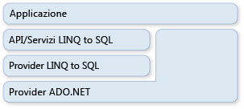

# ADO.NET e LINQ to SQL
[!INCLUDE[vbtecdlinq](../../../../../../includes/vbtecdlinq-md.md)]fa parte della famiglia di tecnologie ADO.NET. Si basa sui servizi forniti dal modello di provider ADO.NET. È pertanto possibile combinare [!INCLUDE[vbtecdlinq](../../../../../../includes/vbtecdlinq-md.md)] il codice con le applicazioni ADO.NET esistenti ed eseguire la migrazione [!INCLUDE[vbtecdlinq](../../../../../../includes/vbtecdlinq-md.md)]delle soluzioni ADO.NET correnti a. Nell'illustrazione seguente viene fornita una panoramica della relazione.  
  
   
  
## connessioni  
 È possibile specificare una connessione ADO.NET esistente quando si crea un [!INCLUDE[vbtecdlinq](../../../../../../includes/vbtecdlinq-md.md)] oggetto <xref:System.Data.Linq.DataContext>. Tutte le operazioni eseguite <xref:System.Data.Linq.DataContext> su (incluse le query) utilizzano questa connessione specificata. Se la connessione è già aperta, [!INCLUDE[vbtecdlinq](../../../../../../includes/vbtecdlinq-md.md)] la lascia invariata al termine dell'operazione.  
  
 [!code-csharp[DLinqCommunicatingWithDatabase#4](../../../../../../samples/snippets/csharp/VS_Snippets_Data/DLinqCommunicatingWithDatabase/cs/Program.cs#4)]
 [!code-vb[DLinqCommunicatingWithDatabase#4](../../../../../../samples/snippets/visualbasic/VS_Snippets_Data/DLinqCommunicatingWithDatabase/vb/Module1.vb#4)]  
  
 È comunque possibile accedere alla connessione e chiuderla usando la proprietà <xref:System.Data.Linq.DataContext.Connection%2A>, come nel codice seguente:  
  
 [!code-csharp[DLinqAdoNet#1](../../../../../../samples/snippets/csharp/VS_Snippets_Data/DLinqAdoNet/cs/Program.cs#1)]
 [!code-vb[DLinqAdoNet#1](../../../../../../samples/snippets/visualbasic/VS_Snippets_Data/DLinqAdoNet/vb/Module1.vb#1)]  
  
## Transazioni  
 È possibile fornire l'oggetto <xref:System.Data.Linq.DataContext> con la transazione di database personalizzata qualora l'applicazione abbia già avviato la transazione e si desideri che venga usato anche <xref:System.Data.Linq.DataContext>.  
  
 Il metodo preferito per eseguire transazioni con la .NET Framework consiste nell'utilizzare l' <xref:System.Transactions.TransactionScope> oggetto. Usando questo approccio, è possibile creare transazioni distribuite che potranno essere usate sia con database che con altri gestori di risorse residenti in memoria. Per gli ambiti di transazione è necessario avviare alcune risorse. Si promuovono a transazioni distribuite solo quando sono presenti più connessioni nell'ambito della transazione.  
  
 [!code-csharp[DLinqAdoNet#2](../../../../../../samples/snippets/csharp/VS_Snippets_Data/DLinqAdoNet/cs/Program.cs#2)]
 [!code-vb[DLinqAdoNet#2](../../../../../../samples/snippets/visualbasic/VS_Snippets_Data/DLinqAdoNet/vb/Module1.vb#2)]  
  
 Non è possibile usare questo approccio per tutti i database. La connessione SqlClient, ad esempio, non è in grado di innalzare di livello le transazioni di sistema quando funziona con un server SQL Server 2000. Al contrario, viene inserita automaticamente in una transazione distribuita completa quando viene rilevato l'uso di un ambito della transazione.  
  
## Comandi SQL diretti  
 In alcune situazioni la capacità di <xref:System.Data.Linq.DataContext> di eseguire query o inviare modifiche è insufficiente per l'attività specifica che si desidera eseguire. In queste circostanze è possibile usare il metodo <xref:System.Data.Linq.DataContext.ExecuteQuery%2A> per inviare comandi SQL al database e convertire i risultati della query in oggetti.  
  
 Ad esempio, si supponga che i dati per la classe `Customer` siano distribuiti in due tabelle (customer1 e customer2). La query seguente consente di restituire una sequenza di oggetti `Customer`:  
  
 [!code-csharp[DLinqAdoNet#3](../../../../../../samples/snippets/csharp/VS_Snippets_Data/DLinqAdoNet/cs/Program.cs#3)]
 [!code-vb[DLinqAdoNet#3](../../../../../../samples/snippets/visualbasic/VS_Snippets_Data/DLinqAdoNet/vb/Module1.vb#3)]  
  
 Finché i nomi di colonna nei risultati tabulari corrispondono alle proprietà di colonna della classe di entità [!INCLUDE[vbtecdlinq](../../../../../../includes/vbtecdlinq-md.md)] , crea gli oggetti da qualsiasi query SQL.  
  
### Parametri  
 Il metodo <xref:System.Data.Linq.DataContext.ExecuteQuery%2A> accetta l'uso di parametri. Nel codice seguente viene eseguita una query con parametri:  
  
 [!code-csharp[DlinqAdoNet#4](../../../../../../samples/snippets/csharp/VS_Snippets_Data/DLinqAdoNet/cs/Program.cs#4)]
 [!code-vb[DlinqAdoNet#4](../../../../../../samples/snippets/visualbasic/VS_Snippets_Data/DLinqAdoNet/vb/Module1.vb#4)]  
  
> [!NOTE]
> I parametri sono espressi nel testo della query usando la stessa notazione con parentesi graffe usata da `Console.WriteLine()` e `String.Format()`. `String.Format()` sostituisce quindi i parametri con parentesi graffe presenti nella stringa fornita con nomi di parametro generati, ad esempio `@p0`, `@p1` …, `@p(n)`.  
  
## Vedere anche

- [Informazioni di base](background-information.md)
- [Procedura: Riutilizzare una connessione tra un comando ADO.NET e un DataContext](how-to-reuse-a-connection-between-an-ado-net-command-and-a-datacontext.md)
