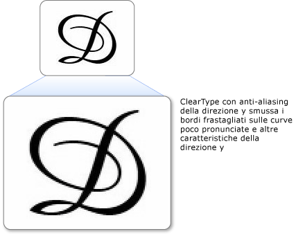

# Cenni preliminari su ClearType
Questo argomento offre una panoramica della tecnologia [!INCLUDE[TLA#tla_ct](../../../../includes/tlasharptla-ct-md.md)] presente disponibile in [!INCLUDE[TLA#tla_winclient](../../../../includes/tlasharptla-winclient-md.md)].  

   
## Informazioni generali sulla tecnologia  
 ClearType è una tecnologia software sviluppata da [!INCLUDE[TLA#tla_ms](../../../../includes/tlasharptla-ms-md.md)] che consente di migliorare la leggibilità del testo sugli schermi LCD (Liquid Crystal Display), ad esempio schermi portatili, schermi Pocket PC e monitor Flat Panel.  ClearType funziona tramite l'accesso ai singoli elementi stripe dei colori verticali in ogni pixel di uno schermo LCD. Prima di ClearType, il livello di dettaglio più basso che un computer poteva visualizzare era un singolo pixel, ma con ClearType in esecuzione su un monitor LCD, ora è possibile visualizzare le funzionalità del testo di piccole dimensioni come una frazione di un pixel in larghezza. La risoluzione aggiuntiva aumenta la nitidezza dei piccoli dettagli nella visualizzazione del testo, rendendone più facile la lettura per periodi prolungati.  
  
 ClearType disponibile in [!INCLUDE[TLA#tla_winclient](../../../../includes/tlasharptla-winclient-md.md)] è la generazione più recente di ClearType che presenta diversi miglioramenti rispetto alla versione disponibile [!INCLUDE[TLA#tla_gdi](../../../../includes/tlasharptla-gdi-md.md)]in.  
  
   
## Posizionamento dei subpixel  
 Un miglioramento significativo rispetto alla versione precedente di ClearType è l'utilizzo del posizionamento dei subpixel. A differenza dell'implementazione di ClearType disponibile [!INCLUDE[TLA2#tla_gdi](../../../../includes/tla2sharptla-gdi-md.md)]in, il ClearType trovato [!INCLUDE[TLA#tla_winclient](../../../../includes/tlasharptla-winclient-md.md)] in consente l'avvio dei glifi all'interno del pixel e non solo del limite iniziale del pixel. Grazie a questa risoluzione aggiuntiva nel posizionamento dei glifi, la spaziatura e le proporzioni dei glifi risultano più precise e coerenti.  
  
 Nei due esempi seguenti viene mostrato come è possibile inserire i glifi su qualsiasi limite del subpixel se si usa il posizionamento dei subpixel. Nell'esempio a sinistra viene eseguito il rendering utilizzando la versione precedente del renderer ClearType, che non utilizza il posizionamento dei subpixel. L'esempio a destra viene sottoposto a rendering usando la nuova versione del renderer ClearType, usando il posizionamento dei subpixel. Notare che il rendering dei caratteri **e** e **l** nell'immagine a destra è leggermente diverso in quanto ognuno inizia in corrispondenza di un subpixel diverso. Quando il testo viene visualizzato sullo schermo con le dimensioni normali, questa differenza non è ben visibile a causa dell'elevato contrasto dell'immagine del glifo Questa operazione è possibile solo grazie a un sofisticato filtro dei colori incorporato in ClearType.  
  
   
Testo visualizzato con la versione precedente e quella successiva di ClearType  
  
 Nei due esempi seguenti viene confrontato l'output del renderer ClearType precedente con la nuova versione del renderer ClearType. Il posizionamento dei subpixel, mostrato a destra, consente di migliorare notevolmente la spaziatura dei tipi sullo schermo, specialmente alle dimensioni più piccole, in cui la differenza tra un subpixel e un pixel intero rappresenta una parte significativa della larghezza del glifo. Notare che la spaziatura tra le lettere è più uniforme nella seconda immagine. Il vantaggio cumulativo del posizionamento dei subpixel all'aspetto complessivo di una schermata di testo è notevolmente maggiore e rappresenta un'evoluzione significativa nella tecnologia ClearType.  
  
   
Confronto tra il testo visualizzato con la versione precedente di ClearType e quello visualizzato con la versione successiva  
  
   
## Anti-aliasing della direzione Y  
 Un altro miglioramento di ClearType [!INCLUDE[TLA#tla_winclient](../../../../includes/tlasharptla-winclient-md.md)] in è l'anti-aliasing della direzione y. ClearType in [!INCLUDE[TLA2#tla_gdi](../../../../includes/tla2sharptla-gdi-md.md)] senza anti-aliasing della direzione y offre una risoluzione migliore sull'asse x, ma non sull'asse y. Nelle parti superiori e inferiori delle curve poco pronunciate, i bordi frastagliati riducono la leggibilità.  
  
 L'esempio seguente mostra l'effetto dell'assenza di anti-aliasing della direzione y. In questo caso, i bordi frastagliati nella parte superiore e inferiore della lettera sono chiaramente visibili.  
  
   
Testo con bordi frastagliati su curve poco pronunciate  
  
 ClearType in [!INCLUDE[TLA#tla_winclient](../../../../includes/tlasharptla-winclient-md.md)] fornisce l'anti-aliasing sul livello di direzione y per smussare tutti i bordi frastagliati. Tale funzionalità è particolarmente importante per migliorare la leggibilità delle lingue asiatiche, nelle quali gli ideogrammi presentano un quantità quasi uguale di curve poco pronunciate orizzontali e verticali.  
  
 L'esempio seguente illustra gli effetti dell'anti-aliasing della direzione Y. In questo caso, la parte superiore e quella inferiore della lettera mostrano una curva uniforme.  
  
   
Testo con anti-aliasing della direzione y ClearType  
  
   
## Accelerazione hardware  
 ClearType in [!INCLUDE[TLA#tla_winclient](../../../../includes/tlasharptla-winclient-md.md)] può trarre vantaggio dall'accelerazione hardware per migliorare le prestazioni e ridurre i requisiti di memoria di sistema e di carico della CPU. Utilizzando i pixel shader e la memoria video di una scheda grafica, ClearType fornisce un rendering più veloce del testo, in particolare quando viene utilizzata l'animazione.  
  
 ClearType in [!INCLUDE[TLA#tla_winclient](../../../../includes/tlasharptla-winclient-md.md)] non modifica le impostazioni ClearType a livello di sistema. La disabilitazione di [!INCLUDE[TLA#tla_mswin](../../../../includes/tlasharptla-mswin-md.md)] ClearType [!INCLUDE[TLA#tla_winclient](../../../../includes/tlasharptla-winclient-md.md)] in imposta l'anti-aliasing sulla modalità scala di grigi. Inoltre, ClearType in [!INCLUDE[TLA#tla_winclient](../../../../includes/tlasharptla-winclient-md.md)] non modifica le impostazioni del PowerToy del sintonizzatore [ClearType](https://www.microsoft.com/typography/ClearTypePowerToy.mspx).  
  
 Una delle decisioni relative alla progettazione dell'architettura di [!INCLUDE[TLA#tla_winclient](../../../../includes/tlasharptla-winclient-md.md)] consiste nel disporre di monitor DPI a risoluzione più elevata con supporto migliorato del layout indipendente dalla risoluzione, di diffusione sempre maggiore. Come conseguenza di tale scelta, [!INCLUDE[TLA#tla_winclient](../../../../includes/tlasharptla-winclient-md.md)] non supporta il rendering del testo con anti-aliasing o le bitmap in alcuni tipi di carattere asiatici in quanto entrambi sono dipendenti dalla risoluzione.  
  
   
## Ulteriori informazioni  
 [Informazioni su ClearType](https://www.microsoft.com/typography/ClearTypeInfo.mspx)  
  
 [ClearType Tuner PowerToy](https://www.microsoft.com/typography/ClearTypePowerToy.mspx)  
  
## Vedere anche

- [Impostazioni del Registro di sistema ClearType](cleartype-registry-settings.md)
